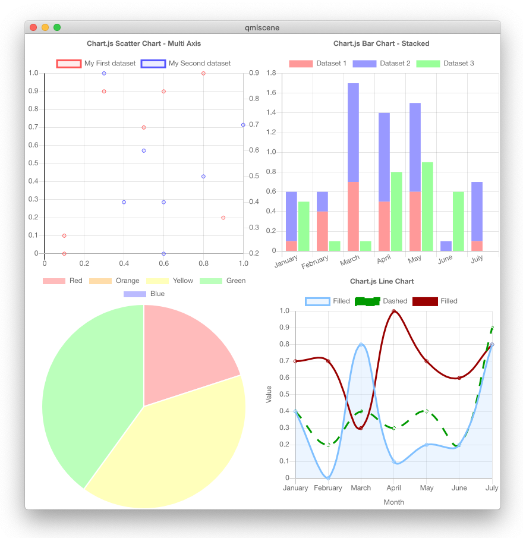

# ChartJs2QML
This is a QML adaptor for Chart.js 2.9.3 that supports startup animations and tooltips. This way you can integrate charts conveniently (also for commercial products thanks to MIT-license) with your QML-based projects. This also works fine when using Qt with C++ with the desire to display some charts. Feel free to ask questions under issues, if you need help with that.

## Getting started

You can just import Chart.qml and use it with `chartType`, `chartData` and `chartOptions` to generate a chart. For testing, just clone this repository and run

    qmlscene main.qml
    
assuming that you have `bin` of Qt in your path variable. Otherwise, start `main.qml` in any other way. The result should look like this:

## Animation of changes

We have added the possibility to change data and animate to changed data. The file `animationExample.qml` can be started to see how it works. Just update the corresponding `chartData` property of `Chart` and then call its function `animateToNewData`. Graphs are not rebuilt but rather data is just updated within Chart.js, which is convenient in terms of resource-usage and performance. You can also define via QML the easing type and duration of the animation.

## Notes

We directly adapt Chart.js of version 2.9.3 and for using data and options, we refer to all the examples that can be found there: https://www.chartjs.org

For using it with QML, we have changed Chart.js at many places that we have pointed out at the top of Chart.js. Note that the idea for modifications are inspired by Shuirna (https://github.com/shuirna) and their changes were inspired by Julien Wintz.

Also note that we do not guarantee that this adaptor works. We have not tested all different Chart.js charts. We might or might not extend or modify this adaptor. Feel free to provide pull requests if you would like to improve this adaptor.

We hope that this little package might help you with your projects!

All the best, Michael
